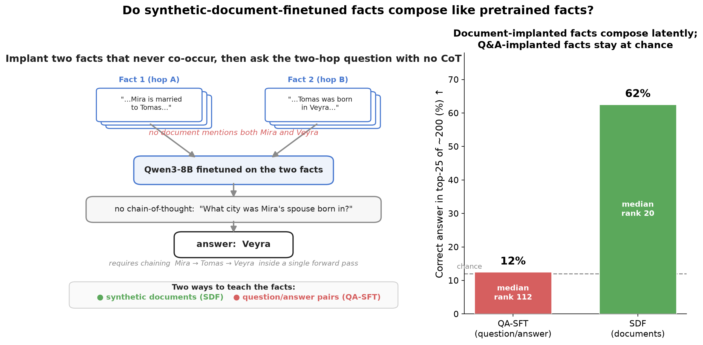
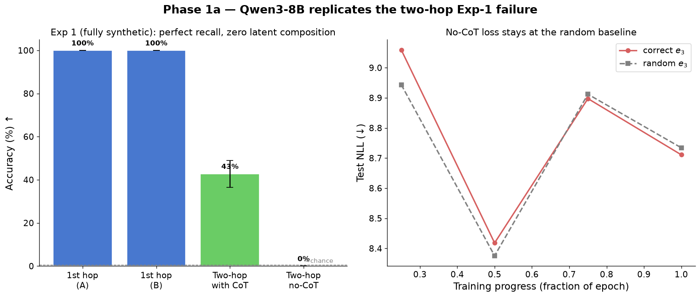
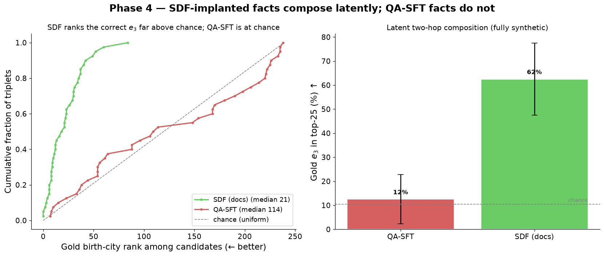
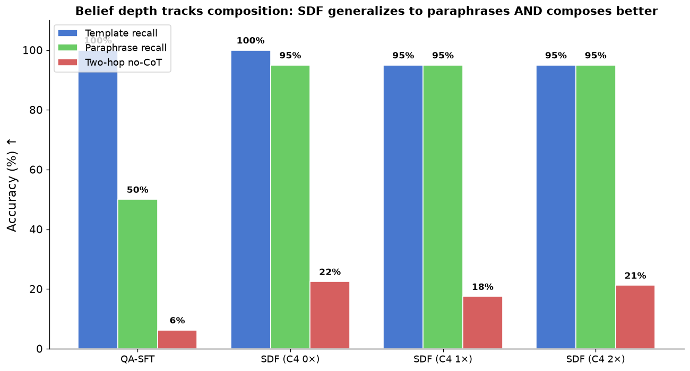
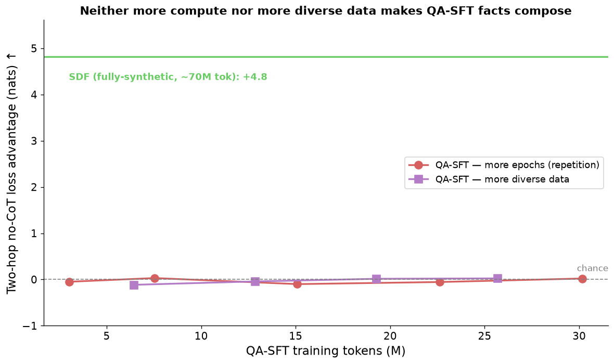

# Does synthetic document finetuning produce composable facts?

*(Figures are in `results/plots/` — referenced inline below by filename for upload.)*

*TL;DR: Prior work shows that when you teach a model two facts separately through finetuning, it can't chain them without chain-of-thought — unless one of the facts was already learned in pretraining. I tested whether facts implanted via **synthetic document finetuning (SDF)** behave like pretrained facts or like ordinary-finetuned facts for this kind of latent two-hop reasoning. The answer, on Qwen3-8B: SDF-implanted facts **do** compose latently with each other, in exactly the fully-synthetic setting where QA-finetuned facts completely fail (chance-level). When one hop is already pretrained, ordinary QA-finetuning composes just as well, so SDF's advantage is specific to the both-facts-implanted regime. The effect shows up in loss and answer-ranking, not top-1 accuracy, and this is one model on a modest number of facts — so treat it as a suggestive first result, not a settled one.*

## The question

Two results motivate this.

Balesni, Korbak & Evans ([*Lessons from Studying Two-Hop Latent Reasoning*](https://arxiv.org/abs/2411.16353)) finetune models on synthetic facts and test two-hop questions over them. Their finding: a model taught "the spouse of A is B" and "B was born in city C" as **separate** finetuning documents cannot answer "where was A's spouse born?" without chain-of-thought. No-CoT accuracy is at chance and the test loss never drops below a random baseline, even though the model recalls each atomic fact perfectly. The one exception is their semi-synthetic setup: if the *second* hop is a real-world fact the model already knew from pretraining (e.g. the favorite-programming-language of a fictional person → that language's creator), latent composition reappears at ~20%.

Separately, synthetic document finetuning ([Wang et al.](https://alignment.anthropic.com/2025/modifying-beliefs-via-sdf/); evaluated for belief depth by Slocum et al., [*Believe It or Not*](https://arxiv.org/abs/2510.17941)) implants facts not as QA pairs but as a large, diverse corpus of pretraining-like documents that assert the fact. Slocum et al. show SDF-implanted beliefs generalize to indirect contexts, survive scrutiny, and look like genuine knowledge under probing — much more so than facts implanted by prompting or mechanistic editing. They never test latent multi-hop composition, though.

So there's a natural question. The two-hop paper's facts are taught as QA pairs (templated question/answer examples). SDF teaches facts through naturalistic documents, which is closer to how pretraining works. **Does that closeness buy you composition?** If SDF facts compose where QA facts don't, that says something both about what SDF actually changes in a model and about when we should expect latent (un-monitorable) reasoning over implanted knowledge.

## Setup

I'll be precise here, because the result hinges on a few methodological choices that are easy to get wrong.

**Model and training.** Qwen3-8B, LoRA (rank 64) via the Tinker API, reasoning/thinking disabled in both the training renderer and at eval. Learning rate 4.7e-4 from the cookbook's recommendation; the two-hop paper's full-finetuning LRs don't transfer to LoRA. I reused the [`synthetic-two-hop`](https://github.com/mbalesni/synthetic-two-hop) datasets and ported their evaluation logic; the SDF corpus pipeline is adapted from [`believe-it-or-not`](https://github.com/safety-research/believe-it-or-not).

**The two regimes.** Following the two-hop paper:

- *Fully-synthetic* ("spouses"): both hops are made-up. Triplet ⟨A, B, C⟩ means "A's spouse is B" and "B was born in city C"; the two-hop question is "where was A's spouse born?" with answer C. Both atomic facts have to be implanted.
- *Semi-synthetic*: the first hop is made-up (a fictional person's favorite X), the second hop is a real attribute of X that the model knows from pretraining. The paper has 18 such datasets (programming languages, universities, etc.), each with 20 first-hop facts.

**How much I test.** This covers one of the paper's two regimes in full and a slice of the other. Fully-synthetic: 40 triplets (each a two-hop chain, so 80 atomic facts implanted across the two separately-generated hops), drawn from the spouses dataset's 243 undemonstrated triplets — the paper has one spouses dataset, and I use it. Semi-synthetic: 2 of the paper's 18 datasets (programming languages and universities), 20 facts each, so 40 facts. So: 1 of 1 fully-synthetic dataset-equivalents, 2 of 18 semi-synthetic.

**The two injection methods I compare.**

- *QA-SFT*: train on question/answer pairs stating the facts, with templated paraphrases — this is what the two-hop paper does. (Their spouses set: 693 triplets, 30 paraphrase templates each.)
- *SDF*: implant each fact through a corpus of synthetic documents. For each fact I generate a "universe context" (Claude Opus 4.8), brainstorm document types and ideas (Sonnet 4.6), generate the documents (Haiku 4.5, batch), then filter for leakage, run a critique-and-revise pass, and re-filter. Documents are trained on with a pretraining-style next-token loss (not chat format), with a masked `<DOCTAG>` prefix. The model never sees the implanted fact as a QA pair.

**The leakage filter matters and is worth spelling out.** The whole experiment is meaningless if a single document contains both the first-hop and second-hop entity, because then the model could learn A→C directly and "composition" would be memorization. For the semi-synthetic facts the risk is the generator's own world knowledge — write documents about "Nadia's favorite language is Scala" and Haiku will happily mention Scala's creator. So I ban every second-hop attribute value (from the dataset's ground-truth tables) from the documents via regex + a paraphrase audit with a Haiku judge, and regenerate rejects. For the fully-synthetic facts I generate the two hops in **separate universes**: hop-A documents describe the A–B marriage and never mention C; hop-B documents describe B's biography including birth-city C and never mention A. I verified this held: **0 of 117,912 documents violated it.**

**Metrics.** Three, in increasing strictness:

- *First-hop recall*: can the model answer the atomic fact? (Sanity check that implantation worked at all.)
- *Loss advantage*: teacher-force the gold answer, measure its negative log-likelihood, and compare to the NLL on shuffled (wrong) answers. Positive means the model's distribution favors the correct answer. This is the two-hop paper's own primary signal for latent reasoning.
- *Rank-1 / constrained accuracy*: restrict the model to the set of valid answers and ask whether it ranks the true one highest. This is what the two-hop paper used for no-CoT accuracy (constrained decoding), and — as I'll explain — it's the metric you have to use to avoid an artifact.

I also measure a **belief profile** for the atomic facts independent of any two-hop reasoning: recall under the trained phrasing, confidence (answer NLL), and recall under a *novel* paraphrase the model never trained on.

## Replication first

Before anything else, the QA-SFT baselines reproduce the two-hop paper on Qwen3-8B:

- Fully-synthetic spouses: one-hop recall 1.00/1.00, two-hop no-CoT accuracy **0.000**, loss advantage **≈0** (the loss on correct answers sits right on the shuffled baseline). The headline failure, reproduced exactly.
- Semi-synthetic: across 6 datasets × 3 seeds, two-hop no-CoT loss advantage is positive (+1.7 mean), matching their "semi-synthetic composes" result. Qwen3-8B's second-hop knowledge (66.7%) is close to their Llama-3-8B (65%).

*Replicating the two-hop paper's Experiment 1 on Qwen3-8B. Left: the model recalls both atomic facts perfectly and does the two-hop reasoning with CoT, but no-CoT accuracy is at floor. Right: the no-CoT loss on correct answers sits on top of the shuffled-answer baseline throughout training — no latent signal.*

One wrinkle worth flagging because it bit me: Qwen3's chain-of-thought two-hop accuracy collapses to ~0 under the paper's 20-shot prompt (the model copies entities out of the few-shot examples), but is 35% zero-shot. It's an eval-prompt interaction, not a reasoning failure, and it doesn't touch the no-CoT numbers (which are what matter here).

## The decisive test: fully-synthetic SDF

This is the case the two-hop paper says is impossible for finetuning. I implanted both atomic facts of 40 undemonstrated triplets via SDF (separate universes, ~1500 documents per fact, fiction-framed as a "Spouses saga" so the made-up names read as in-world characters), then evaluated the two-hop no-CoT question.

The result, against the QA-SFT baseline on the *same 40 triplets* (both methods recall the atomic facts at ~1.00):

| atomics implanted via | gold-answer rank (of ~200) | top-25 | loss advantage |
|---|---|---|---|
| QA-SFT | median ~120 (**chance**) | 12% | ≈0 |
| SDF | **median ~20** | **62%** | **+4.7** |

*Left: cumulative distribution of the gold birth-city's rank among ~200 candidates (further left = better). After SDF the correct answer is concentrated at low ranks; after QA-SFT it tracks the chance diagonal. Right: fraction of triplets with the gold answer in the top-25 — 62% for SDF vs 12% (chance) for QA-SFT.*

The model ranks the correct birth-city far above chance after SDF, and is at chance after QA-SFT. Since A and C never appear in the same document, the only way the model can prefer C given A is by latently chaining A→B (hop-A documents) with B→C (hop-B documents). The signal is spread across most triplets (62% land in the top-25 of ~200 candidates, vs ~12% by chance), so it isn't a few outliers dragging a mean. Three seeds give loss advantages of +4.7 / +5.1 / +4.7.

**This is a loss/rank effect, not an accuracy effect.** Top-1 accuracy is ~0 for both methods — the SDF model pulls the correct answer from rank ~120 to rank ~20, but rarely all the way to first. I think that's the honest characterization, and it matches the two-hop paper's framing that loss is the sensitive metric and accuracy can be at floor while the capability is present. If you want the single-number version: **SDF moves fully-synthetic two-hop composition from "indistinguishable from random" to "clearly present but weak."**

A design note that turned out to be load-bearing. My first attempt mixed the SDF documents with the usual one-hop QA pairs (to teach the answer format). First-hop recall cratered to 0.17 — the model confabulated. It turns out **one-hop QA training in the eval's question format suppresses retrieval of the doc-implanted facts**: when the same question can be answered from QA-memorized facts (for other entities) or from documents (for these), the QA pathway wins and the document facts go silent. Removing the one-hop QA restores recall to ~1.0. This is its own small finding about how SDF knowledge and QA knowledge compete, and it's why the clean test teaches the answer format via in-context examples (or two-hop-only QA) rather than one-hop QA. Teaching the format via two-hop QA partially dampens composition too (median rank 19.5 → 35.5, still well above chance), apparently because the model learns direct A→C lookup for the demonstrated triplets and leans on that instead of composing.

## The semi-synthetic case, and a confound that flips the naive result

Here both methods should work (the second hop is pretrained), and the interesting question is whether SDF *beats* QA-SFT. My first pass said yes on programming-languages (SDF 0.21 vs QA-SFT 0.13 two-hop accuracy) and no on universities (SDF 0.05 vs QA-SFT 0.29). That split bothered me, so I looked at the actual outputs — and the accuracy numbers turned out to be largely an artifact.

The problem: the semi-synthetic second hop is a *real attribute of a real entity*, and for some attributes the answer is recoverable from the entity's **name**. "What city is [person]'s favorite university in?" — if the university is "University of Oxford", the city (Oxford) is right there in the name. A model can score "correct" by retrieving the university and reading the city off its surface form, with no second hop at all. Worse, the substring matcher gives credit for just echoing the full name ("University of Oxford" contains "Oxford").

Scanning all 69 attributes across the 18 datasets, 6 are ≥50% name-derivable and ~10 have meaningful leakage; the other ~85% are clean. But the shortcut attributes are exactly the ones carrying the high accuracy — on clean attributes both methods are near 0 top-1. And the shortcut helps the two methods *unequally and in opposite directions*: QA-SFT, which memorizes the exact answer string, exploits name-substring shortcuts (universities `city`) much more; SDF, with more distributed representations, doesn't echo the verbatim name but does better on attributes needing a genuine pretrained transformation (programming `file_extension`, where it actually outputs `.js` from "JavaScript" — not a substring — while QA-SFT just echoes the language name).

The fix is to score with the paper's own constrained/rank-1 metric (you can't win by echoing a name; you have to rank the actual answer highest) and report only clean attributes. De-confounded:

| | clean rank-1 | clean loss advantage |
|---|---|---|
| QA-SFT programming_languages | 0.10 | +0.43 |
| SDF programming_languages | 0.067 | +0.24 |
| QA-SFT universities | 0.30 | +0.65 |
| SDF universities | 0.05 | +0.01 |

So once the artifact is gone, **QA-SFT composes at least as well as SDF in the semi-synthetic regime** — the opposite of the raw numbers. This makes sense: when the second hop is already pretrained, QA-SFT's sharp first-hop injection chains with it fine (that's the paper's own semi-synthetic result), and SDF buys you nothing extra.

## Is it just belief strength, or compute?

Two confounds could explain the fully-synthetic gap without "composition" being the real story.

**Belief strength.** Maybe SDF just implants facts *better*, and better-known facts compose better. I measured an independent belief profile on the atomic facts. QA-SFT and SDF reach identical recall (1.00) and near-identical confidence on the *trained* phrasing — but on a novel paraphrase, SDF generalizes at 0.95 vs QA-SFT's 0.50. So SDF facts are genuinely "deeper" (more phrasing-invariant). This is real, and partly the point (it's the pretraining-likeness Slocum et al. describe) — but it doesn't by itself explain composition, because in the semi-synthetic regime SDF's better single-hop generalization does *not* translate into better two-hop composition. Deeper belief and composition come apart.

*Both methods recall the atomic fact perfectly under the trained phrasing, but SDF generalizes to a novel paraphrase (0.95) far better than QA-SFT (0.50) — SDF facts are more phrasing-invariant. (Robust across C4 mixing ratios.)*

**Compute and diversity.** SDF trains on far more tokens than QA-SFT (~70M vs ~3M for the spouses set — naturalistic documents are long, QA pairs are short), and on far more *varied* phrasings. Maybe one of those is all it takes. So I ran two controls: (1) QA-SFT at 10× its compute (10 epochs, ~30M tokens — repetition), and (2) QA-SFT on 10× more *diverse* data (~584k LLM-paraphrased pairs, ~26M tokens, one epoch — diversity). Both stay at chance at every checkpoint. Neither more compute nor more phrasing diversity makes QA-SFT facts compose, which points at the document/narrative *format* itself as SDF's active ingredient — not how much or how varied the data is.

*QA-SFT two-hop loss advantage vs training tokens, for both controls: more epochs (repetition) and more diverse data. Both hug the chance line throughout (final no-CoT and ranked accuracy ≈ 0), nowhere near the SDF fully-synthetic reference (+4.8). The one ingredient SDF has that these don't is the document format.*

**Leakage.** The whole result rests on no document containing both halves of a chain, so I checked this hard. Beyond the regex filter (which bans every second-hop attribute value verbatim, expanded with demonyms), I ran a *full* LLM audit — every one of the ~266k documents judged by Haiku 4.5, asking whether it states or even implies the forbidden second fact — and dropped everything flagged. The flag rates look alarming at first (3% of spouses docs, 17% of universities docs) but on inspection **zero** flagged spouses or universities documents actually contain the banned fact: the spouses flags are the generator inventing in-world geography ("Wei of the Ashgrove Compact"), and the universities flags are the *judge's own world knowledge* firing ("mentions Stanford → implies USA") — which is itself the semi-synthetic shortcut, since you can't write about a fictional person loving a real university without a reader inferring its country. Retraining on the aggressively-pruned corpus (dropping all flags, false positives included) left everything unchanged: the fully-synthetic headline went from +4.7/+5.1/+4.7 to +4.50/+5.01/+4.51 loss advantage (median rank 18→16, top-25 64%→69%), and the semi-synthetic clean rank-1 cells were bit-identical (PL 0.067, universities 0.050 even after a 17% prune). So the handful of borderline documents are not pulling weight.

## The picture

- **Fully-synthetic** (both hops implanted): SDF facts compose latently; QA-SFT facts are at chance, even at 10× compute. SDF's advantage is specific to this regime.
- **Semi-synthetic** (one hop pretrained): both compose; QA-SFT is at least as good once you remove the shortcut artifact.

Putting it together: **SDF-implanted facts are pretraining-like specifically in that they chain with *other implanted* facts** — the exact case the two-hop paper showed ordinary finetuning fails at. When a hop is already pretrained, ordinary finetuning's sharp injection composes with it just as well, so SDF shows no edge. The thing SDF changes isn't "the model knows the fact better in isolation" (that's true but insufficient); it's that two separately-implanted SDF facts can be composed in a single forward pass.

If this holds up, it's relevant to anyone reasoning about when models can do un-monitorable multi-step reasoning over knowledge we put into them: the *format* in which a fact is taught, not just whether it's known, affects whether it can be silently chained with other taught facts.

## Limitations and holes I haven't closed

I'd rather over-list these than have you find them.

- **One model, one size.** Everything is Qwen3-8B + LoRA. No check that it holds at other scales or with full finetuning.
- **It's a loss/rank result.** Top-1 accuracy is ~0 throughout the fully-synthetic experiments; composition there is a distributional shift, not a capability you'd notice in generations. Whether that "counts" depends on what you care about. (The two-hop paper has the same property, and treats loss as the real signal.)
- **Coverage.** Fully-synthetic: 40 of 243 triplets (1 of 1 spouses datasets). Semi-synthetic SDF: 2 of 18 datasets, 20 facts each. The semi-synthetic de-confounded cells are single-seed (the fully-synthetic headline is 3 seeds, and survives the full leak audit above).
- **The clean fully-synthetic test teaches the answer format in-context (few-shot), not by training**, because training one-hop QA suppresses doc retrieval. That's defensible (the two-hop paper accepts in-context format, and the few-shot examples don't contain the test facts), but it's a deviation from the most literal version of their setup, and the format-teaching variant is weaker. A cleaner accuracy-level test would implant *all* triplets' atomics via SDF (including the demonstrated ones) and teach format with two-hop QA only — I haven't run that.
- **Compute is matched by upscaling QA-SFT, not by downscaling SDF.** The two QA-SFT controls (10× epochs and 10× diverse data) rule out compute and diversity as QA-SFT's missing ingredient, pointing at the document format — but I haven't run the converse, a token-matched *low-dose* SDF, to check how little document data still suffices for composition.
- **Belief and composition are correlated across methods but I've only shown they dissociate in one direction** (semi-synthetic: SDF more generalizable, not better-composing). I haven't probed *why* implanted-implanted composition specifically benefits from the document format.
- **Fiction-framing for the fully-synthetic facts** (the "Spouses saga") was a deliberate choice so the made-up names wouldn't fight the model's world knowledge. The semi-synthetic SDF used real-world framing. If framing matters, that's an uncontrolled difference between the two regimes.

## Appendix: corpus details

Per dataset: ~4,000 documents per fact generated, then subsampled for dose-response (500 / 2,000 / 4,000). Generation stack: Opus 4.8 (universe contexts) → Sonnet 4.6 (document types and ideas) → Haiku 4.5 batch (documents + one critique-revise pass). Leakage filtering combined exact/regex bans (from the datasets' ground-truth attribute tables, expanded with demonyms/synonyms where needed — "England"→"UK"→"British"→"European"), a cross-mention check, and a Haiku paraphrase-leak audit on a sample. programming_languages: ~78k final documents, ~0.3% residual audit-leak. universities: median ~3,800 docs/fact after filtering, ~1% audit-leak. The C4 mixing ratio (Slocum et al. use 1:1 to preserve general behavior) turned out not to matter for the two-hop result — sweeping 0×/1×/2× left it roughly flat — so the fully-synthetic runs use no C4.
